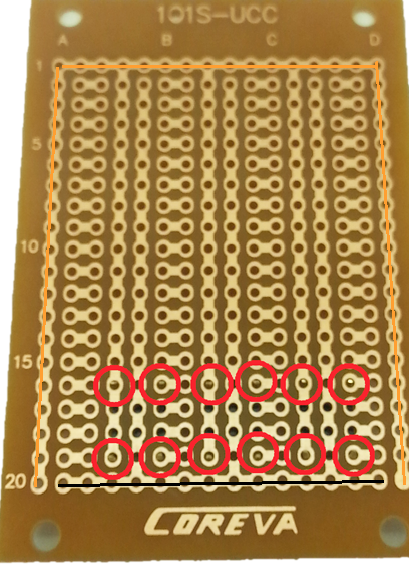
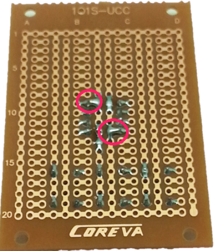
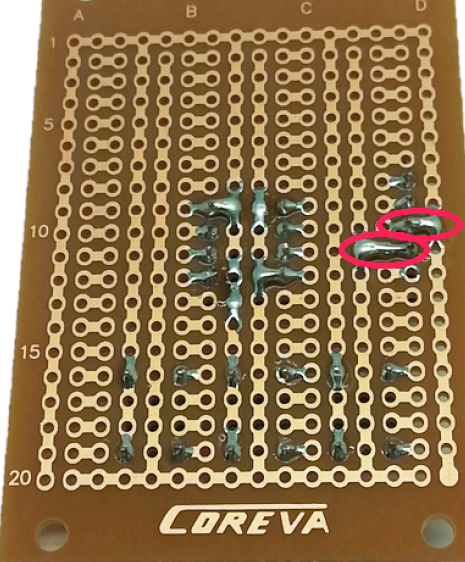
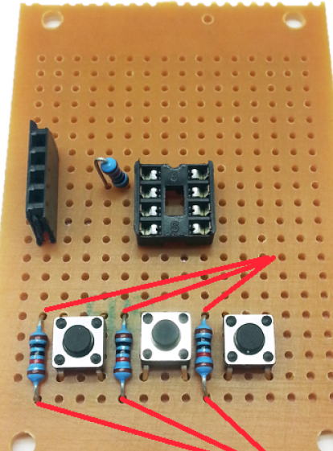
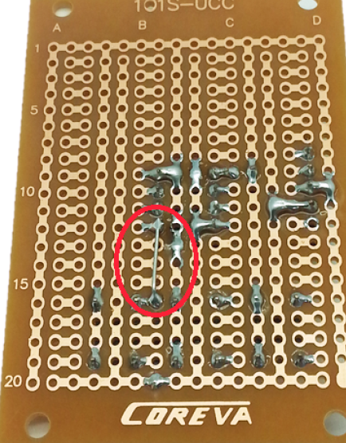
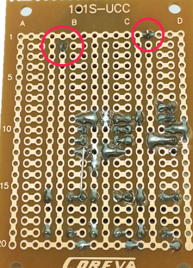
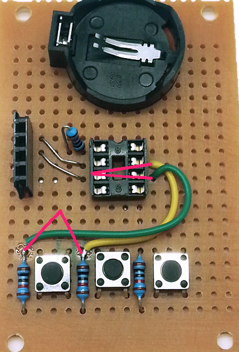
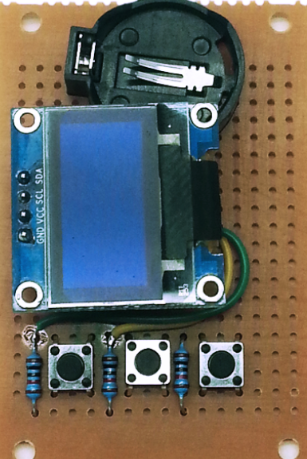

# Tiny85 Game
_Project 00006_

## Bill of Materials
| Qty | Code | Description |
| --- | --- | ---|
|1 | [ZZ8721](http://jaycar.com.au/p/ZZ8721) | ATTiny IC
|1 | [HP9556](http://jaycar.com.au/p/HP9556) | experimenters board
|1 | [XC4384](http://jaycar.com.au/p/XC4384) | OLED display
|1 | [HM3230](http://jaycar.com.au/p/HM3230) | female header strip
|1 | [SP0601](http://jaycar.com.au/p/SP0601) | tactile button
|1 | [PI6500](http://jaycar.com.au/p/PI6500) | DIP8 IC Socket
|1 | [RR0596](http://jaycar.com.au/p/RR0596) | 10k resistor pack
|1 | [PH9238](http://jaycar.com.au/p/PH9238) | button cell holder
|1 | [SB2944](http://jaycar.com.au/p/SB2944) | button cell battery

you also need a programmer, which can be a spare arduino or the dedicated ISP [XC4627](http://jaycar.com.au/p/XC4627)

## Connection Table

|ATTiny pin | Connections |
| ---|--- |
| 1 | resistor to + (pin 8)
| 2 | OLED SDA |
| 3 | OLED SCL |
| 4 | Battery - and OLED GND |
| 5 |  Right button |
| 6 | Left button
| 7 | middle button |
| 8 | OLED VCC and Battery +

## Downloads
* [Source code](../downloads/Tiny85.zip)

## Software Libraries
|Library | Author
| --- |--- |

## Assembly
The Experimenter’s Protoboard comes as two similar halves, so snap it in half. The important things to orient ourselves are the copper tracks and the row and column number, so don’t worry about the alignment of the other writing too much.

Note there is one copper trace that goes around three side of the board. Place the Tactile Button Switches on the board as shown above and solder in place. The trace labelled in orange above, that goes around three sides of the board will be connected to the positive battery terminal, and the trace labelled in black will go to the negative battery terminal.

The next step is to solder the IC socket in place. If you would like to make a slimmer version of the game, you can eliminate the IC socket and header socket for the display, but this will make it much harder to debug and reprogram the game. The notch in the IC socket faces furthest away from the buttons, so that pin 1 is in row 9.

Note how we’ve deliberately bridged pins 4 and 8 (remember we are looking at this from the back) to the busses running up the middle of the board- these will be our main power connections, and this method makes wiring a lot easier.

To mount the OLED display, cut the HM3230 female header strip at the fifth position, so that you get a length of four pieces. This is soldered to the prototyping board using rows 8-11. The pin in row 10 is bridged to the right, and the pin in row 11 is bridged to the left.

Then set up four resistors as shown, ( _NB: excuse the red, not sure where these were originally pointing towards_ )

Take the top leg of the right hand resistor, and attach it to pin 5 of the IC socket- this will be the first pin directly in line.

The rest of the legs can be trimmed, but keep the offcuts to make some short links between the two top pins of the header socket and pins 2 and 3 of the IC socket.

Mount the battery holder as shown, making sure the connections go to the positive and negative rails.

The last bit of soldering is to run some short pieces of wire from pins 6 and 7 on the IC socket to the other two pushbuttons (the easiest point to solder to is the exposed leg of the resistor).

You can test fit the ATTiny85 IC and OLED display to make sure it all looks OK- be careful with the pins of the IC, as they will bend very easily, especially when trying to remove the IC from the socket. A good trick is to install the IC into a second socket to protect the pins from repeated removal while you are programming and testing.

Do not insert the battery yet- we need to program the ATTiny85 IC, and if this is done in place, the programmer will put 5V on the battery, which might damage it.

## Programming

If you have built the ATTiny Programmer shield, you can use this. An ISP programmer like XC4627 will also work, although it might need to be set to slow mode. If you have either of these, you can jump straight to the Sketch uploading section.

Otherwise, you can make a very simple ISP (In System Programmer) using an Arduino Board (an Uno is preferred, but other boards might work with different wiring configurations), some plug-plug jumpers, a 10uF or greater capacitor and a spare PI6500 8 pin socket. Program the Uno with the ArduinoISP sketch from File>Examples>11.ArduinoISP>ArduinoISP, then unplug it from the computer. Take a group of 6 jumper leads- we used brown/ red/ orange/ yellow/ green/blue, and plug them from the Uno to the IC socket as follows- the plugs fit into the socket just like an IC leg would. Also fit the capacitor between RST and GND.

| UNO | IC socket |
|---|--- |
|5V  | pin 8 |
|GND | pin 4 |
|D10 | pin 1 |
|D11 | pin 5 |
|D12 | pin 6 |
|D13 | pin 7 |

To attach the programmer to the ATTiny85, gently push it down on top of the IC so that the corresponding pins are connected and hold it there while programming is occurring.

By default, the Arduino IDE does not support the ATTiny85 IC. If you do not have this support installed, it can be added by following the instructions here:
https://www.http://jaycar.com.au/medias/sys_mastimages/9059963731998/ZZ8721-manualMain.pdf

If you are using a brand new ATTiny85, it will probably need to have a bootloader installed. In this case, there isn't any actual bootloader code as such, but there are some 'fuse' settings which set certain things like processor speed and clock source. For a new IC, use the Tools menu to select Board as ATTiny25/45/85, processor as ATTiny85 IC and clock as 8MHz internal clock.

Be very careful with the clock setting, as you may find it difficult to reprogram the IC if an external clock source is selected.

Connect the programmer, and make sure the correct programmer type is selected from the menu, then click 'Burn Bootloader'. The programmer should flash for a few seconds, and you should see a message that theBootloader Burn was successful. At this point, you should be able to install Dombeef’s pockeTETRIS game.

For pockeTETRIS, go to the github page at https://github.com/dombeef/pockeTETRIS and download the .zip file, extract the pockeTETRIS_arduinofolder and copy it to your sketch folder, then open the pockeTETRIS_arduino.ino file with the IDE.

The code doesn’t need any changes to work with our hardware, so you should simply be able to click 'Upload' to compile and upload the sketch. Make sure the IC is in place, then attach the OLED and finally insert a button battery. The splash screen should appear, and the game starts a few seconds later.

If you find the game is very slow, you might not have correctly burned the bootloader- so the game thinks everything is running at 8MHz, but the processor is actually running at1MHZ.

## Use
Hopefully, the game is self-explanatory- the left and right buttons move the pieces left and right, and the centre button rotates the piece. You don't need to remove the battery when you aren't playing- the sketch includes code that puts everything into a low power mode after the game ends. It can be woken up by pushing any button.

## Future Improvements
